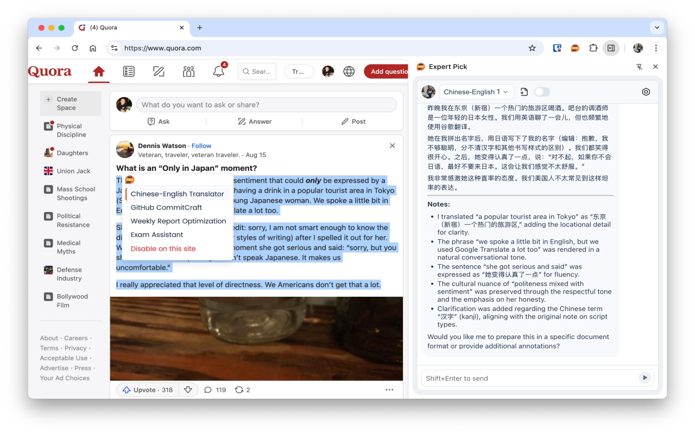

  <!-- Expert Pick carousel -->
  

    <h3>Expert Pick</h3>
    <svg width="100%" viewBox="0 0 1200 700" xmlns="http://www.w3.org/2000/svg" preserveAspectRatio="xMidYMid slice" role="img" aria-label="Expert Pick slideshow">
      <rect width="100%" height="100%" fill="#111" />

      <image href="assets/expertpick/screenshot-chat-element.webp" x="0" y="0" width="1200" height="700" preserveAspectRatio="xMidYMid slice" opacity="1">
        <animate attributeName="opacity" values="1;0;0;1" keyTimes="0;0.333;0.666;1" dur="9s" repeatCount="indefinite" />
      </image>

      <image href="assets/expertpick/screenshot-settings-expert.webp" x="0" y="0" width="1200" height="700" preserveAspectRatio="xMidYMid slice" opacity="0">
        <animate attributeName="opacity" values="0;1;0;0" keyTimes="0;0.333;0.666;1" dur="9s" repeatCount="indefinite" />
      </image>

      <image href="assets/expertpick/screenshot-settings-model.webp" x="0" y="0" width="1200" height="700" preserveAspectRatio="xMidYMid slice" opacity="0">
        <animate attributeName="opacity" values="0;0;1;0" keyTimes="0;0.333;0.666;1" dur="9s" repeatCount="indefinite" />
      </image>

      <!-- Fallback: visible if SVG animation is not supported in viewer -->
      <a href="#">
        <rect x="0" y="600" width="1200" height="100" fill-opacity="0" />
      </a>
    </svg>
    <!-- Static fallback for environments that don't animate SVGs -->
    <noscript>
      
    </noscript>
  

  <!-- GitAssistant carousel -->
  

    <h3>GitAssistant</h3>
    <svg width="100%" viewBox="0 0 1200 700" xmlns="http://www.w3.org/2000/svg" preserveAspectRatio="xMidYMid slice" role="img" aria-label="GitAssistant slideshow">
      <rect width="100%" height="100%" fill="#111" />

      <image href="assets/gitassistant/Screenshot%202025-10-30%20at%2016.54.15.png" x="0" y="0" width="1200" height="700" preserveAspectRatio="xMidYMid slice" opacity="1">
        <animate attributeName="opacity" values="1;0;0;1" keyTimes="0;0.333;0.666;1" dur="9s" repeatCount="indefinite" />
      </image>

      <image href="assets/gitassistant/Screenshot%202025-10-30%20at%2016.54.29.png" x="0" y="0" width="1200" height="700" preserveAspectRatio="xMidYMid slice" opacity="0">
        <animate attributeName="opacity" values="0;1;0;0" keyTimes="0;0.333;0.666;1" dur="9s" repeatCount="indefinite" />
      </image>

      <image href="assets/gitassistant/Screenshot%202025-10-30%20at%2016.54.48.png" x="0" y="0" width="1200" height="700" preserveAspectRatio="xMidYMid slice" opacity="0">
        <animate attributeName="opacity" values="0;0;1;0" keyTimes="0;0.333;0.666;1" dur="9s" repeatCount="indefinite" />
      </image>
    </svg>
    <noscript>
      
    </noscript>
  

