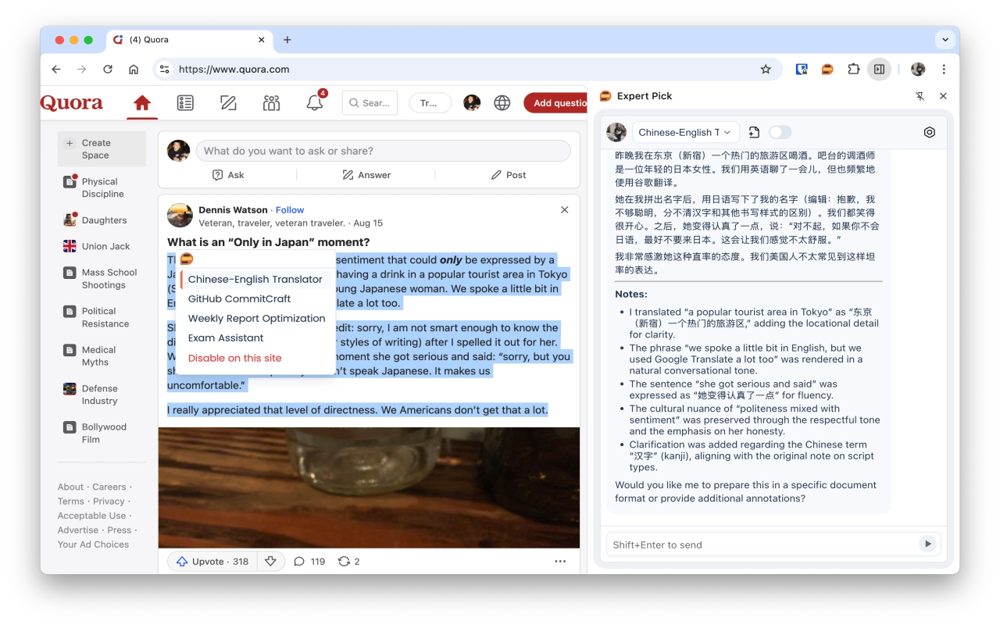
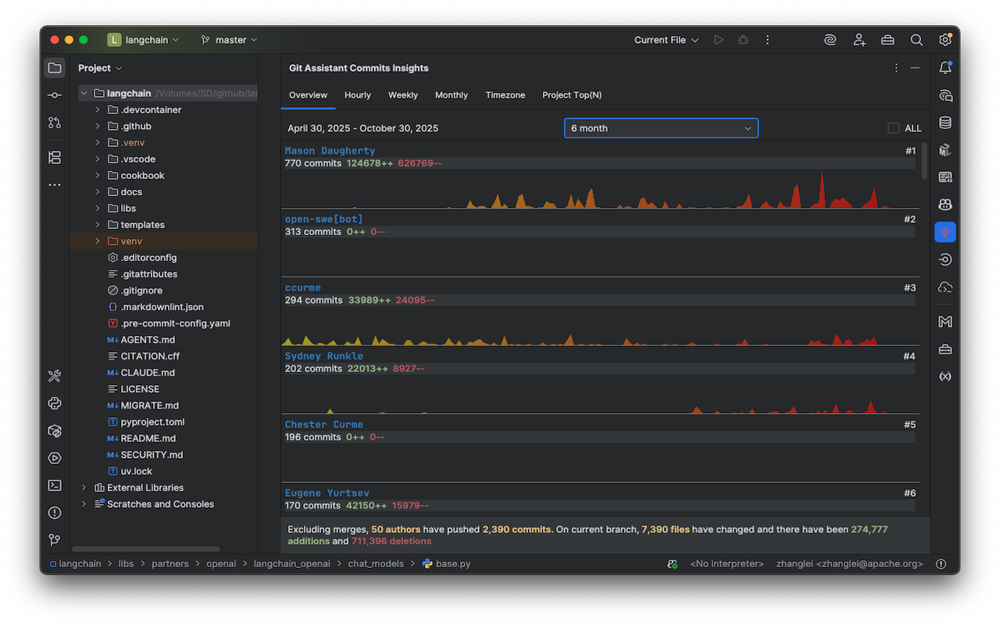

<h1 align="center">👋 Hi, I'm Lei Zhang</h1>

  <strong>AI & Open Source Engineer | ASF PMC & Committer @ Apache ServiceComb</strong> 
  <em>Creator of <a href="https://expertpick.pages.dev/">Expert Pick</a> and <a href="https://gitassistant.pages.dev/">Git Assistant</a></em>

<table width="100%" cellspacing="0" style="border-collapse: collapse; border: none;">
  <tr>
    <td style="border: 0; padding: 0;">
      
    </td>
    <td style="border: 0; padding: 0;">
      
    </td>
  </tr>
</table>
<table width="100%">
  <colgroup>
    <col span="1" width="50%" />
    <col span="1" width="50%" />
  </colgroup>
  <thead>
    <tr>
      <th scope="col" width="50%" valign="top" align="center">Expert Pick</th>
      <th scope="col" width="50%" valign="top" align="center">Git Assistant</th>
    </tr>
  </thead>
  <tbody>
    <tr>
      <td valign="top" align="center">
        
        

            Expert Pick is a Chrome extension that enables element-level intelligent Q&A, custom expert creation, and multi-model integration.
        

        

          
        
        
      </td>
      <td valign="top" align="center">
        
        

            Git Assistant is an IntelliJ plugin that provides AI-powered commit message generation and team commit insights, helping developers commit faster, more consistently, and visualize collaboration more effectively.
        

        

          
          
        

      </td>
    </tr>
  </tbody>
</table>
